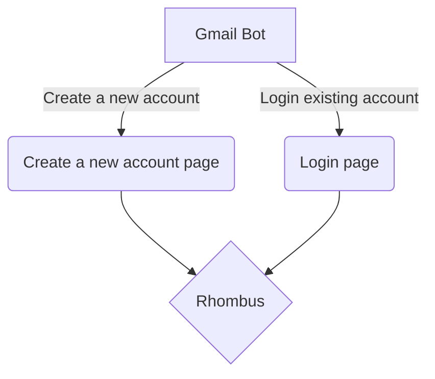

# Gmail Bot 

------------

The procedure a flow chart of *Gmail Bot*:


Tip: You could put your secret things in .env files

### How to get update from the branch "main"?

First check which branch you are on.
```bash
git branch
```

If your current branch is not "main". Switch to the "main" branch.
```bash
git checkout main
```

Pull the updates from the remote origin main
```bash
git pull origin main
```

Go back to the branch that you use for the development.
```bash
git checkout dorji
```

Update the branch "dorji" with main using merge.
```bash
git merge main
```
